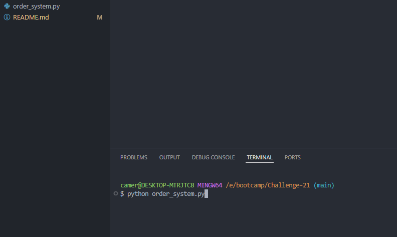
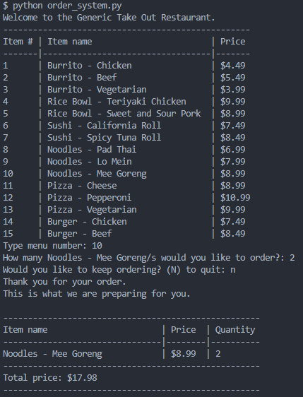

# Python-Food-Order


### Table of Contents
- [Description](#description)
- [How to Install](#how-to-install)
- [Usage](#usage)
- [License](#license)
- [Contributors](#contributors)
- [Questions](#questions)
- [Application Images](#application-images)


---

## Description

This is a cli program that runs using Python. It contains a menu for a user to choose items to order from and displays the results of their choices.

## How to Install

These steps are used to install and start the application:

1. **Clone the Repository**:

   ```bash
   git clone git@github.com:Runnerrupert/Python-Food-Order.git
   ```

2. **Navigate to the Project Directory**:

   ```bash
   cd your-repository
   ```

3. **Start The Program**:

   ```bash
   python3 your-file-name 
            or 
   python your-file-name
   ```

## Usage

**Answer Prompts**:

   - You will be given prompts for items to order.
   - Type the number of the item you would like to order. 
   - Type the quantity of the item you would like to order.
   - Select "N or n" to exit the loop and see your receipt

## License

For more information about the MIT license, use this link!
 https://memgraph.com/blog/what-is-mit-license

For a better understanding, I give you permission to use, copy, modify, distribute and sell copies at your own discretion.

---

## Contributors

University Of Utah Coding Bootcamp and Cameron Barfuss

Specifically, The coding bootcamp has taught different code practices to use to be able to create a functioning cli in using Python. I wrote the code for the place_order, update_order and print_itemized_receipt functions, all other functions were written by the University of Utah Coding Bootcamp.

---

## Questions

My Github: https://github.com/Runnerrupert

My Email Address: Cameron.barfuss@gmail.com

You can contact me using my Github link or via Email if you have any questions about Python-Food-Order.

--

## Application Images


